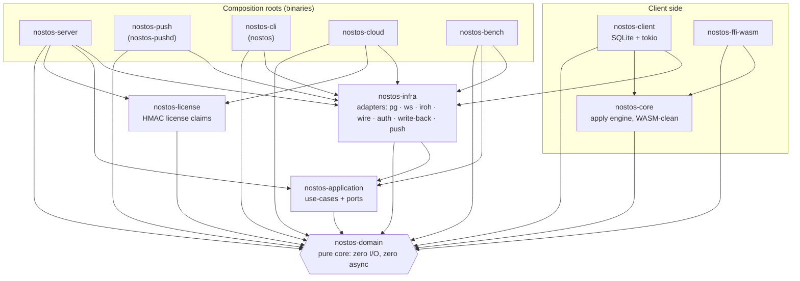

# Nostos Architecture

> *Ports & Adapters (hexagonal) + DDD. The domain never knows about tokio, postgres, or axum — and that is the whole point.*

This document describes the **as-built** architecture of Nostos (formerly Cairn; updated 2026-09) — server, native client, WASM bridge, push daemon, CLI and Cloud control plane. The repo spans twelve workspace crates; the multi-platform SDK surface ships progressively under `sdk/` (Flutter first-class; web, Kotlin, Swift, .NET, RN following) per [ADR-0015](adr/0015-ffi-bridge-strategy.md) and [ADR-0016](adr/0016-client-sdk-and-wal-bloat-protection.md).

---

## 1. The dependency rule



Arrows are allowed normal (`[dependencies]`) edges; dev-dependencies are not
drawn. The arrow of compile-time dependency **always points inward.** Domain
has no deps on the upper layers. Application defines *ports* (trait
interfaces) that infra implements — *dependency inversion.* This is what lets
the benchmark swap a `FakeReplicator` in for the real `PgReplicator` with zero
changes to domain or use-case code. `nostos-core` sits beside the server
hexagon, not inside it: it depends only on domain, so the same apply engine
runs natively (`nostos-client`) and in the browser (`nostos-ffi-wasm`).

### 1.1 The twelve crates (as-built)

| Crate | Role | May depend on |
|---|---|---|
| `nostos-domain` | pure types + invariants (Predicate, Lsn, events, Principal, Tier). Zero I/O, zero async | — |
| `nostos-application` | use-cases (`FanOutService`, `SessionManager`) + port traits (§2.2) | domain |
| `nostos-infra` | adapters: PgReplicator (feature `pg`), FakeReplicator, WS + iroh (feature `iroh`) transports, wire codec, auth, write-back, oplog, push senders | application, domain |
| `nostos-server` | composition root — the axum binary `nostos-server` | domain, application, infra, license |
| `nostos-core` | client apply engine + Storage trait. WASM-clean: no tokio, no SQLite | domain |
| `nostos-client` | native client: SqliteStorage (rusqlite) + tokio SyncClient | core, domain, infra |
| `nostos-ffi-wasm` | wasm-bindgen bridge over nostos-core | core, domain |
| `nostos-bench` | throughput harness — honest numbers (drops reported, env recorded) | domain, application, infra |
| `nostos-license` | HMAC-signed offline license claims — minted by cloud, verified by server | domain |
| `nostos-push` | standalone push daemon `nostos-pushd` (ADR-0038) | domain, infra |
| `nostos-cli` | the `nostos` CLI — init, dev, doctor, deploy, link, pull, gen, rules, push | domain, infra |
| `nostos-cloud` | control plane `nostos-cloud`: accounts, projects, API keys, Stripe billing, license minting | domain, infra, license |

---

## 2. The layers

### 2.1 `nostos-domain` — the pure core

**Rules:** no `tokio`, no `async`, no `serde` I/O, no `#[derive(Error)]` that references infra. Pure data + invariants. If you can't `cargo test` it without spinning up a runtime, it doesn't belong here.

**Key types:**
- `Lsn` — a Postgres Log Sequence Number (newtype over `u64`). The fundamental unit of replication progress.
- `RowOp { Insert, Update, Delete }` — one row change (`table`, `pk`, payload). Payload is `bytes::Bytes` (cheap to clone across a 1-to-N fan-out).
- `ReplicationEvent { lsn, op, txn_id? }` — an `RowOp` tagged with its source LSN.
- `Predicate { table, filter }` — the *dynamic* subscription filter. **This is the moat** — a full boolean-tree expression engine (`And|Or|Not` + typed comparison `Lt|Gt|Le|Ge` over `Number/Float/Bool/Text`, proven against real PG rows via the JSON column extractor), shipped and documented in [ADR-0012](adr/0012-dynamic-predicate-expression-engine.md). Baseline: ~150–170 eval-only events/sec through 10k predicates (~1.5M predicate-evals/sec).
- `SyncSession { id, predicate }` — one connected client's subscription.

**Why pure:** deterministically unit-testable with no runtime; survives any future async-runtime or framework swap.

### 2.2 `nostos-application` — use-cases & ports

**Rules:** may use `async_trait`, `tracing`, `serde` for port-level DTOs. No `tokio` runtime types leaked into signatures (the port returns `BoxStream` / uses an abstract sink, not `tokio::sync::mpsc::Sender`).

**Port traits (the driven-side interfaces, `crates/nostos-application/src/ports.rs`):**

| Port | Core method(s) | Purpose |
|---|---|---|
| `ReplicatorStream` | `next_event() -> Option<ReplicationEvent>`, `advance_progress(lsn)` | the change feed; progress drives slot confirm (ADR-0009) |
| `SessionStore` | `add`, `remove`, `candidates_for(&event) -> Vec<SessionCandidate>`, `min_acked_lsn` | session registry + the table index |
| `EventSink` | `deliver(Arc<ReplicationEvent>) -> DeliveryDecision` | one session's outbound channel; backpressure is the adapter's call |
| `SyncAuth` | `authenticate(token) -> Option<Principal>` | `/sync` authentication (ADR-0010) |
| `WriteBack` | `upsert`, `delete`, `patch`, `increment` | client writes → source Postgres (ADR-0013, ADR-0018) |
| `OpLogWriter` / `OpLogSource` | `append` / `replay_after`, `window_tail` | persisted op-log backfill (ADR-0025) |
| `SnapshotSource` | `snapshot`, `snapshot_stream` | initial snapshot for a new subscription |
| `SchemaSource`, `TableStatsSource` | `fetch`, `table_stats` | `GET /schema` discovery (ADR-0021) |
| `PushNotifier` | `notify(PushHint)` | sync-aware push doorbell (ADR-0037) |

**Use-cases (the driving-side entry points):**
- `FanOutService` — the hot loop: `ReplicatorStream → evaluate predicates via SessionStore → deliver to each matching EventSink`. The core of the throughput moat.
- `SessionManager` — `connect(session)` / `disconnect(id)`, enforcing the tier device cap. Called by the transport adapter when a client opens/closes a session.

### 2.3 `nostos-infra` — adapters

Each adapter implements one application port. **All `tokio`/`axum`/`postgres` code lives here and only here.**

| Adapter | Implements port | Notes |
|---|---|---|
| `PgReplicator` | `ReplicatorStream` | Real PG logical replication: `pgoutput` parsing via `pgwire-replication` + `tokio-postgres`, behind feature `pg`. LSN checkpointing, slot management, reconnect/heartbeat (ADR-0009). |
| `FakeReplicator` | `ReplicatorStream` | Synthetic WAL generator — drives the benchmark with no PG. Configurable rate & payload size. |
| `MirrorReplicator` / `MirrorHandle` | `ReplicatorStream` / `SnapshotSource` | Mirror ingest for the desktop-sidecar topology (ADR-0042). |
| `InMemorySessionStore` | `SessionStore` | `DashMap` keyed by `Predicate.table` for O(1) candidate lookup. The index that makes dynamic sync fast. |
| `TokioEventSink` | `EventSink` | Per-session bounded `mpsc` channel (`NOSTOS_SESSION_BUFFER`). When full, events conflate per `(table, pk)` (ADR-0045) and are shed only once the overflow holds distinct rows — counted, never silent (ADR-0040). |
| `SupabaseJwtAuth`, `StaticBearerAuth`, `AllowAnonymous` | `SyncAuth` | `NOSTOS_SYNC_AUTH=supabase-jwt` / `bearer` / `none`. |
| `PgWriteBack`, `NoWriteBack` | `WriteBack` | Allowlisted, identifier-checked, bind-parameter writes with tenant force-stamp ([`SECURITY.md`](../SECURITY.md)). |
| `PgOpLogWriter`, `PgOpLogReader` | `OpLogWriter`, `OpLogSource` | The persisted op-log (ADR-0025, ADR-0026). |
| `PgSnapshotter` | `SnapshotSource` | Tenant-scoped initial snapshot. |
| `PgSchemaSource`, `PgTableStats` | `SchemaSource`, `TableStatsSource` | Schema discovery. |
| `PushRouter`, `RemoteNotifier` | `PushNotifier` | In-process APNs/FCM/WebPush rails, or delegation to `nostos-pushd` (ADR-0038). |
| `transport::sync_handler` | — | axum WebSocket upgrade on `/sync` → spawns a `TokioEventSink` per connection + the read loop. `iroh_sync` is the QUIC alternative (feature `iroh`, ADR-0041). |
| `wire` | — | `ReplicationEvent` → human-debuggable JSON frames on the wire. |

### 2.4 `nostos-server` — composition root

The `main()` that reads config, constructs adapters, injects them into use-cases, and binds axum. **The only place that knows which concrete adapters are wired.** `NOSTOS_REPLICATOR=fake` swaps `PgReplicator` → `FakeReplicator` with no other change.

### 2.5 `nostos-bench` — benchmark harness

Runs an in-process `nostos-server` app, N WebSocket clients, and a `FakeReplicator` driving the real `FanOutService`, then measures (bins: `nostos-bench`, `nostos-bench-10k`, `nostos-fanout-walk`, `nostos-reconnect-storm`, `nostos-bench-pg-ingest`). See [`BENCHMARK-METHODOLOGY.md`](BENCHMARK-METHODOLOGY.md).

---

## 3. The hot path — the throughput moat

```
ReplicatorStream::next_event()
        │
        ▼
SessionStore::candidates_for(&event)  ← O(1) by Predicate.table index
        │   filter: candidate.predicate.matches(columns)
        ▼
for sink in matched {                 ← sequential loop, no per-session spawn
    sink.deliver(Arc::clone(&event))  ← bounded try_send; full → conflate / shed (counted)
}
        │
        ▼
advance_progress(min_acked_lsn)       ← durable checkpoint (ADR-0009, shipped)
```

**Three properties that make this fast:**
1. **O(changed rows × matching sessions)**, never O(all sessions). The `Predicate.table` index prunes the candidate set before evaluation.
2. **Cheap clone** — the event is shared as `Arc<ReplicationEvent>` and `RowOp.payload` is a refcounted `bytes::Bytes`, so a 1-to-10,000 fan-out doesn't copy the payload 10,000 times.
3. **Bounded backpressure** — per-session channels with a hard cap. A stalled client's events are conflated, then shed with a metric increment; it can never stall the router.

---

## 4. What's deliberately NOT here (yet)

| Feature | Why deferred | When |
|---|---|---|
| ~~Real `PgReplicator` (pgoutput parsing)~~ | ✅ Shipped behind feature `pg` (`pgoutput` via `pgwire-replication`). | — |
| ~~Dynamic-predicate expression engine (boolean exprs)~~ | ✅ Shipped — boolean tree + typed comparison (ADR-0012). | — |
| ~~Native client + durable checkpoint~~ | ✅ Shipped — `nostos-client` (rusqlite + tokio SyncClient) + `nostos-ffi-wasm` (ADR-0016). | — |
| ~~Direct write-back (the DX moat)~~ | ✅ Shipped — `PgWriteBack` with allowlist + tenant enforcement (ADR-0013, ADR-0018). | — |
| ~~Flutter / RN / Node-native FFI bridges~~ | ✅ Shipped — all bridges (ADR-0015); SDKs live under `sdk/`. | — |
| Custom merge functions | LWW + CRDT add-wins/counter shipped; user-defined merge deferred (ADR-0014, ADR-0030) | Phase 4 (ROADMAP) |

Each deferral has an ADR in [`docs/adr/`](adr/) explaining the trade-off.

---

## 5. Testing strategy

- **Domain:** pure unit tests + `proptest` property tests (e.g. "LSN arithmetic is monotonic").
- **Application:** use-cases tested with **hand-rolled fakes** (`RecordingSink`, `TableStore`, `RecordingReplicator` in `fanout.rs` tests) — no network, no Postgres. This is the payoff of hexagonal design.
- **Infra:** each adapter tested with a real (but minimal) counterpart — `InMemorySessionStore` against a real `FanOutService`; the `/sync` handler against an in-process client (`tests/ws_contract.rs`). Real-Postgres e2e tests self-skip unless `NOSTOS_E2E_PG=1` (`make pg-e2e`).
- **Bench:** the end-to-end throughput harness. Not a unit test — a measurement.

---

## 6. How to add a new port / adapter

1. Define the port trait in `nostos-application`.
2. Add the domain type(s) it operates on in `nostos-domain`.
3. Implement the adapter in `nostos-infra` behind the port.
4. Wire it in `nostos-server`'s composition root.
5. Write a fake/stub for the application-layer tests.

Never let an infra type leak into a port signature. If you find yourself wanting `tokio::sync::mpsc::Sender` in a port, that's a smell — define an abstract sink instead.

---

## 7. Platform assembly (managed Cloud + web)

Beyond the sync engine, Nostos ships a managed Cloud control plane and a web
surface. These are documented in detail in the ADRs; the summary:

- **`nostos-cloud`** — the control plane (axum + rusqlite). Accounts, projects,
  API keys, Stripe billing (`stripe.rs`), HMAC-signed licenses via
  `nostos-license`, and a dual-path auth (Supabase JWT OR session cookie).
  Runs on Fly.io alongside the engine.
- **`web/`** — the SvelteKit 2 + Svelte 5 app (landing + admin), static-exported
  to Cloudflare Pages. Visual identity is "The Nostos Field" (ADR-0008): one
  nostos primitive at two scales, themeable (system + dark + light).
- **`nostos-domain::Tier`** — the portable tier taxonomy (Hobby/Pro/Scale/
  Enterprise) with concurrent-device caps. Lives in the domain ring so both the
  engine (`nostos-server`) and the control plane (`nostos-cloud`) share it without
  either sibling depending on the other.

### Decisions

- [ADR-0007: Platform assembly — Supabase + Rust + Cloudflare + Fly.io](adr/0007-platform-assembly-supabase-rust-cloudflare-fly.md)
- [ADR-0008: Visual identity — The Nostos Field](adr/0008-visual-identity-the-nostos-field.md)

### Reactive-default

Nostos is **reactive-when-connected, queue-when-offline**: the data contract is
always reactive. The push cadence lives in `FanOutService`
(`with_push_interval`, server-side, single-source) so the FFI bridges stay
dumb. Default `Duration::ZERO` (instant, what the benchmark measures).
`nostos-server` exposes no knob for it yet; a managed deploy would set ~1-2s
to coalesce bursts. See ADR-0007 §Reactive-default.
